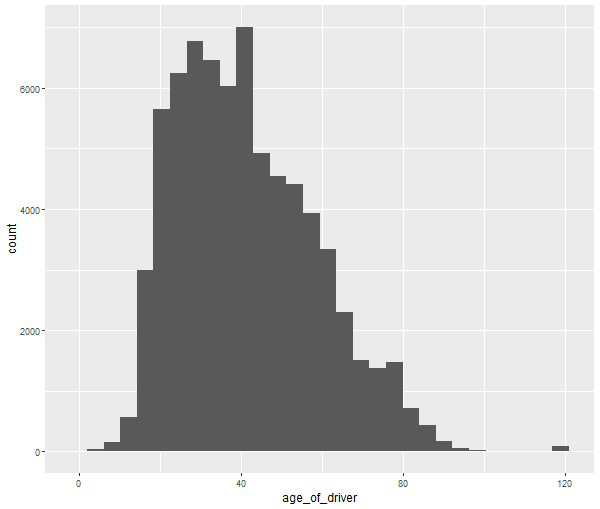
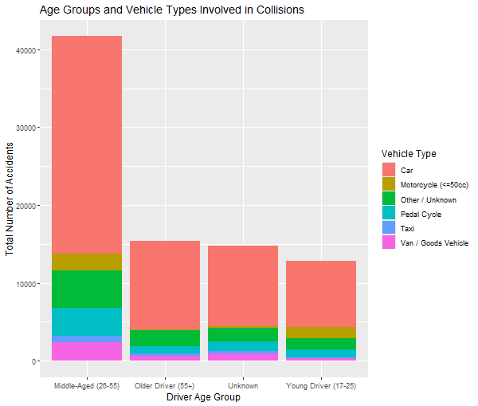

# UK Road Casualty Vehicles Analysis (2024)

*Author: Cansu Gulum*
*Date: 21 September 2025*
*Project Status: Complete*

---

## Project Description

This project performs an exploratory data analysis (EDA) on the "Road Safety Data - Vehicles" dataset for the provisional mid-year of 2024, sourced from data.gov.uk. The primary goal is to clean the raw data and uncover initial insights into the characteristics of vehicles and drivers involved in road casualties in the UK.

The entire analysis is conducted in R, utilizing the Tidyverse and Janitor packages for data manipulation, cleaning, and visualization.

---

## Data Source

* **Title:** Road Safety Data - Vehicles Provisional mid-year unvalidated 2024
* **Source:** data.gov.uk (Department for Transport)
* **Link:** [https://www.data.gov.uk/dataset/cb7ae6f0-4be6-4935-9277-47e5ce24a11f/road-accidents-safety-data](https://www.data.gov.uk/dataset/cb7ae6f0-4be6-4935-9277-47e5ce24a11f/road-accidents-safety-data)

---

## Key Questions & Findings

This analysis aimed to answer two primary questions:

### 1. What is the age distribution of drivers involved in collisions?

The analysis revealed a right-skewed distribution for driver ages.

* **Finding 1.1:** The highest concentration of accidents involves drivers between the ages of 25 and 40.
* **Finding 1.2:** A significant secondary peak is observed for novice drivers in their late teens and early 20s.

### 2. How do vehicle types differ across the identified age groups?

By categorizing drivers into "Young", "Middle-Aged", and "Older" groups, we analyzed the vehicle types most common in accidents for each group.

* **Finding 2.1:** Cars are, by a large margin, the most common vehicle type involved in accidents across all age groups.
* **Finding 2.2:** Motorcycles represent a proportionally larger share of accidents for "Young Drivers" compared to other age groups.
* **Finding 2.3:** The highest absolute number of accidents involving Pedal Cycles occurred in the "Middle-Aged" driver group.

---

## Technical Skills Demonstrated

* Data Cleaning (`janitor::clean_names`, `dplyr::mutate`, `dplyr::na_if`)
* Data Manipulation (`dplyr::group_by`, `dplyr::summarise`, `dplyr::count`, `dplyr::case_when`)
* Exploratory Data Analysis (EDA)
* Data Visualization (`ggplot2`)
* Project Documentation (README.md)