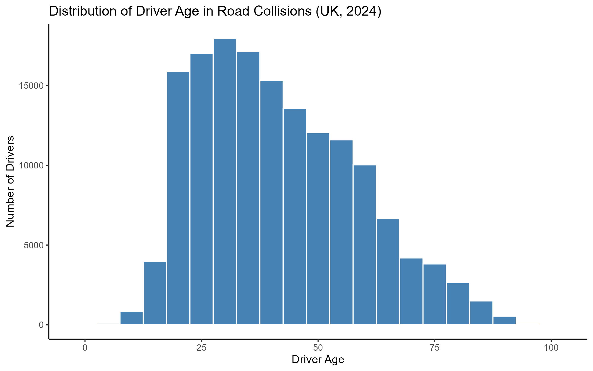
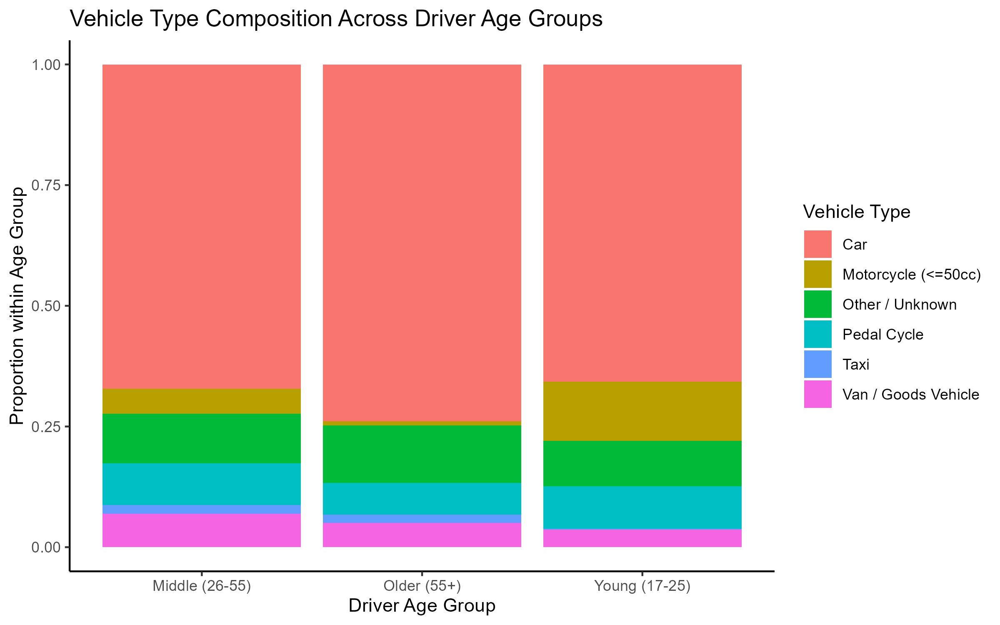

# UK Road Casualty Vehicle Analysis (2024)

**Author:** Cansu Gulum  
**Tools:** R (tidyverse, ggplot2, janitor)

---

## Project Overview

This project explores UK road casualty data (2024) to understand how driver age and vehicle type are associated with collision involvement.

The analysis focuses on:
- Distribution of driver ages
- Differences in vehicle type across age groups

---

## Dataset

- **Source:** UK Department for Transport (data.gov.uk)  
- **Dataset:** Road Safety Data – Vehicles (2024)  
- **Link:** https://www.data.gov.uk/

---

## Workflow

1. Load raw CSV data  
2. Clean column names and handle missing values  
3. Explore driver age distribution  
4. Group drivers into age categories  
5. Analyse vehicle type composition within each group  
6. Visualise results  

---

## Key Findings

- Driver involvement in collisions peaks between ages **25–35**
- Younger drivers show a **higher relative involvement in motorcycles**
- Cars dominate across all age groups, but this reflects overall prevalence

---

## Visualisations

### Driver Age Distribution

### Vehicle Type by Age Group

---

## How to Run

1. Place dataset in the `data/` folder  
2. Open the script in RStudio  
3. Run the script to generate plots  

---

## Skills Demonstrated

- Data cleaning and preprocessing  
- Exploratory data analysis (EDA)  
- Data visualisation with ggplot2  
- Structured project organisation 

---

## Limitations

- The dataset reflects reported collisions, not total driving exposure  
- Results are not normalised by vehicle usage or mileage  
- Limited contextual variables (e.g. region, time of day)
